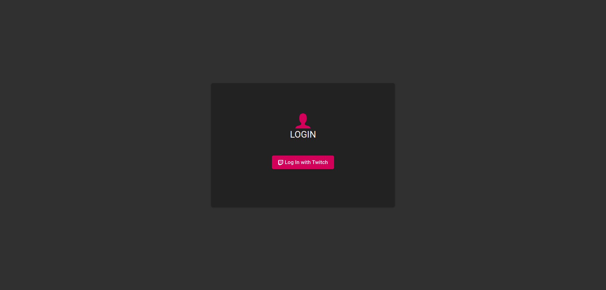
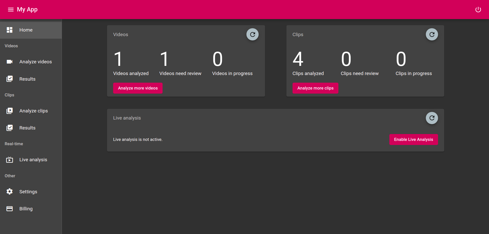
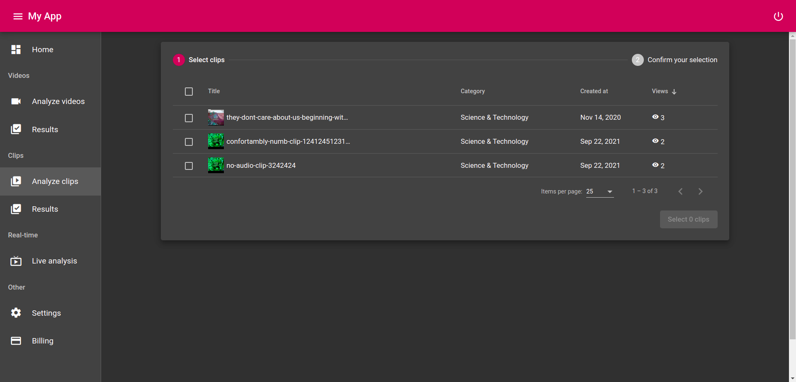
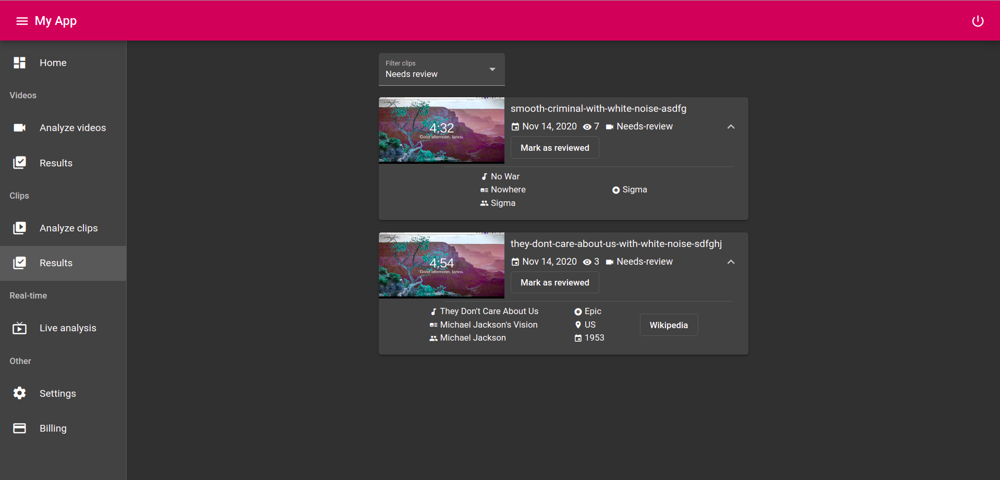
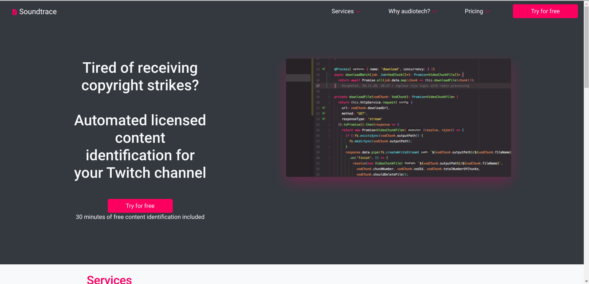
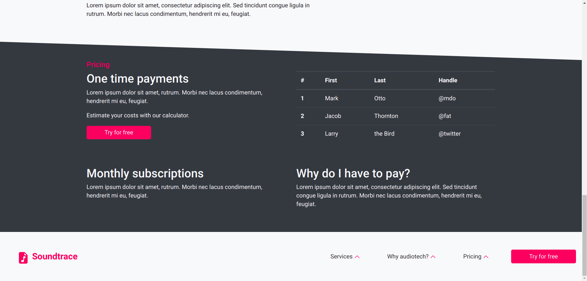
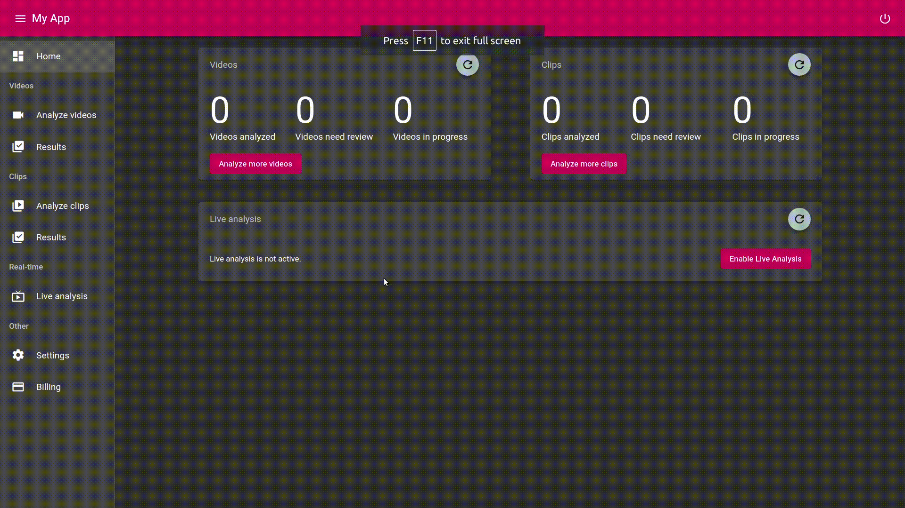
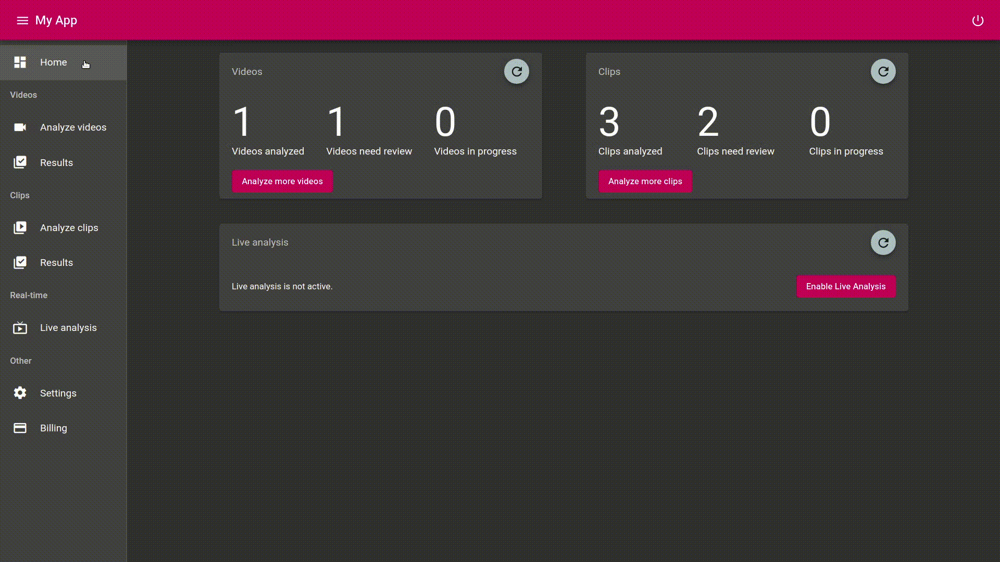

# Instructions for running the web server and Angular client

### 1. Setting the up the local environment

Run `sudo docker-compose` up inside the root folder of the project.
This command will download a download and initialize the PostgreSQL sever and Redis in-memory database necessary for running the app.

### 2. Install all the necessary npm dependencies
    
Run `npm install` in the root folder of the project.

### 3. Make sure you have an `.env` file in the root folder with all necessary API keys and secrets. See `example.env` for more details.

You will need an active ACR Cloud developer account and a Twitch Developer account for this to work

### 4. Start the NestJS server

Run `ng run api:serve` in the root folder of the project.

### 5. Start the Angular web client

Run `ng run client:serve` in the root folder of the project.

### 6. Go to `http://localhost:4200/` and login with your Twitch account. You will be now able to start analysing your Twitch VODs and clips.

  

# Instructions for running the landing page client

### 1. Install all the necessary npm dependencies
    
Run `npm install` in the root folder of the project.

### 2. Run the Angular Universal landing page client

Run `ng run landing-page:serve-ssr` in the root folder of the project.

  

# Project structure

## NestJS server and API

- can be found in `./apps/api/`
- Includes the following functionality:
    - downloading of VODs and clips
    - extraction of audio from clips and VOD chunks using 'ffmpeg'
    - creation of audio fingerprint for the ACR Cloud API
    - communication with ACR cloud API for analysis of audio fingerprints

## Angular web client

- can be found in `./apps/client/`
- Includes the following features:
    ## - login/logout with Twitch account
    
    ## - dashboard with overview of all clips and VODs
    
    ## - audio analysis of Twitch VODs
    ## - view of copyright songs found in your Twitch VODs
    
    ## - audio analysis of your Twitch clips
    
    ## - view of copyright songs found in your Twitch clips
    
    ## - Live analysis: real-time audio analysis of your Twitch streams

## Angular Universal landing page

- can be found in `./apps/landing-page/`
- potential landing page of the project
- 
- 

  
# Demos

## Analyze more clips

## See VOD analysis results

